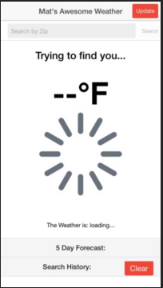
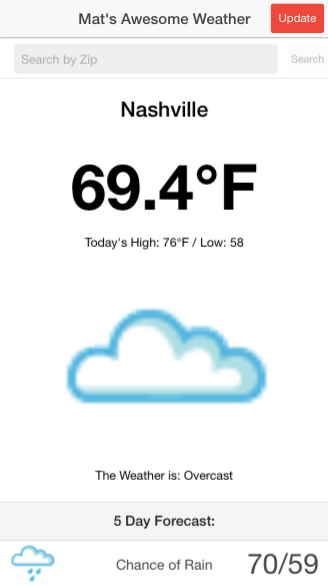
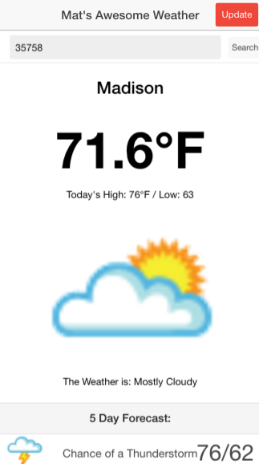
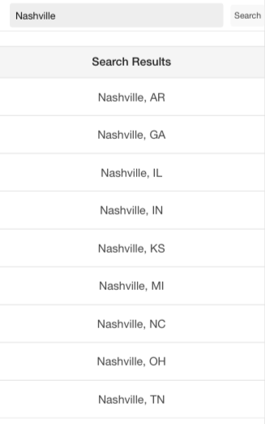
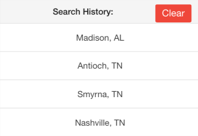

# weather-ionic
An introductory weather app using ionic

## About
This was an exercise in mobile development working with Ionic and Cordova to create a weather app. 

1/12/16 Assignment:
-1. Switch to the Weather Underground API
-2. Use the geoip weather until we get coords
-3. High/Low of the day, 5 day forecast
-4. Search box
-5. Save Searches
Bonus
-B1 Use Search history to store searches in other places
-B2. Ionic Loading Spinner
-B3. Keyboard Return for searching
-B4. Search for Zip or City (Use the response.results to bring a list of suggestions?)

## Requirements
Since it's an Ionic app, you will need Ionic & Cordova. These only run in Node version 4!
I used Node 4.2.6 and NPM 3.5.3 
You will also need Git/Github

## Installing
1. In the directory you want to install, Git Clone this repo
2. Change Directory into the cloned repo
3. Make sure you are in Node version ~4.2
4. In that main directory run `npm install`
5. Optional! Ionic preferes to be installed globally, so if you have issues getting the Ionic commands working try: `npm install -g cordova ionic` 

## Running
1. Change directory into the root of the cloned directory, 
2. `ionic platform add ios`
3. `ionic serve` OR `ionic emulate ios`

## Usage
Upon starting up it will attempt to find your location based on Geolocation (If you have this disabled it will only be able to get a rough estimation based on your IP address)

Once it finds you it will give the current weather conditions, as well as a five day forecast.

You can choose to search for weather in the search bar at the top using zipcode

Or you can search by city name, which will bring up a list of matches in different states to choose from.

The app will also store a small history of your searches into your local storage. You can see this history at the bottom of the app. If you want to clear it, simply hit the 'clear' button.

